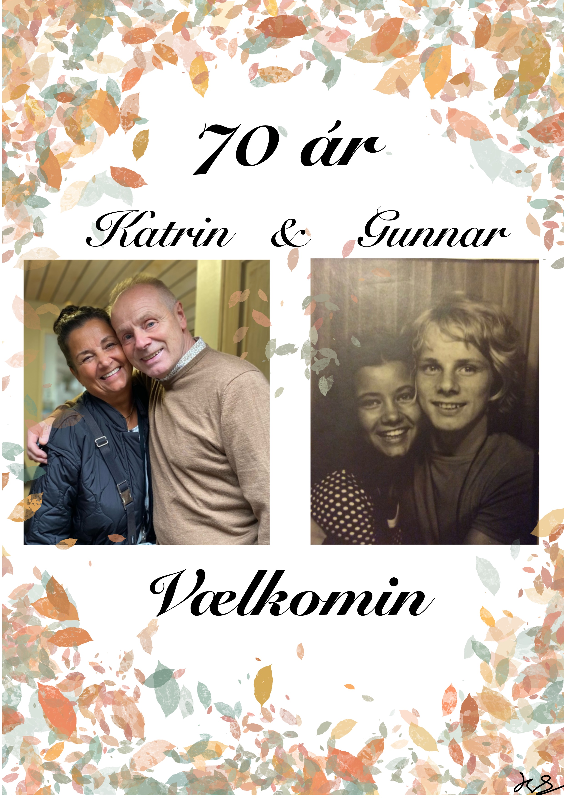

# 🎶 Sanghefti

# 

## 📜 Sangir 

1. [Vælkomin øll](sange/vaelkomin.md)  
2. [When I'm Sixty-Four](sange/when_im_64.md)  
3. [Katrin býr á strondini](sange/katrin.md)
4. [Sjeikurin](sange/sjeikurin.md)
5. [Leygarkvøld í Havn](sange/leygarkvold.md)
6. [Eitt sunnukvøld í plantasjuni](sange/sunnukvold.md)
7. [Sára eitur genta mín](sange/sara.md)
8. [Kom og dansa](sange/kom_og_dansa.md)
9.  [Så længe jeg lever](sange/sa-laenge-jeg-lever.md)
10.  [Einki er sum summarkvøld við strendur](sange/einki-er-sum-summarkvold.md)
11.  [kalli katt](sange/kalli-katt.md)
12.  [Rasmus](sange/rasmus.md)
13.  [Aldan](sange/aldan.md)
14.  [Fiskepigens sang](sange/fiskepigens_sang.md)
15. [Vandringsmænd](sange/vandringsmaend.md)
16.  [Tvær fraðrar](sange/tvar_fjadrar.md)
17.  [Fagra blóma](sange/fagra_bloma.md)
18. [Eg siti so eina](sange/siti_so_eina.md)
19. [Tipperary](sange/tipperary.md)
20. [Sangur til frælsi](sange/Sangur_til_fraelsi.md)
21. 
![Hugnaligar myndir(sange/bagside.docx)

 
 

